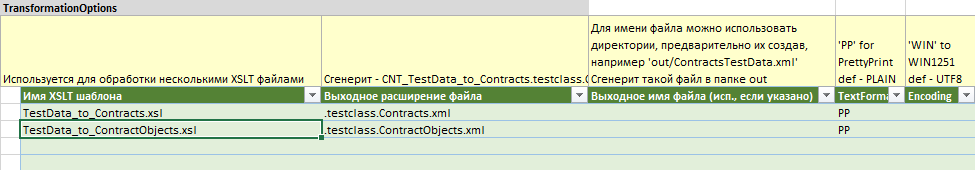

# TestDataGenerator

Генератор тестовых данных использует Excel как точку ввода данных и конвертирует в подходящие XML.

Форк-версия проекта генерирует конкретные XML-тесты.

Доработано и основано на проекте **TestDataGenerator**

* Статья - [Генерация автоматических тестов: Excel, XML, XSLT, далее — везде](https://habr.com/ru/articles/312520/)

* GitHub - [TestDataGenerator](https://github.com/serhit/TestDataGenerator)

**Данные для тест-кейсов**

Собираются в Excel
 Гибкая настройка блоков за счет анализа свободных строк
 

**Гибкие настройки экспорта**

Произвольное количество тест-файлов за счет использования XSLT трансформации

**Запуск пакета скриптов**

Генерация тестовых сценариев через макрос Visual Basic
 Возможность обработать несколько файлов за раз

## Примеры тест-файлов

**SampleTestData.TestData.xml** - промежуточный XML, результат преобразования из EXCEL

* [SampleTestData.TestData.xml](SampleTestData.TestData.xml)

**Сгенерированные XML Контракта и Вопросов контракта**

* [SampleTestData.testclass.contract.xml](SampleTestData.testclass.contract.xml)

* [SampleTestData.testclass.conquests.xml](SampleTestData.testclass.conquests.xml)

## Как запустить

* Открыть Excel (Тестировалось на Excel 2019)
* Склонировать репозиторий в простой пусть (без русских букв и т.п.), например: C:\TestDataGenerator
* Открыть файл-теста [SampleTestData.xlsx](SampleTestData.xlsx)
	* На вкладке *"Options"* раздел *"TransformationOptions"* содержит список *имен файлов-шаблонов XSLT* и соответствующее *выходное расширение файла*.
	* На остальных вкладках Excel *данные для тест-кейсов*, в нашем случае вкладка *"Case1"*. Их может быть несколько
* Открыть файл пакетной обработки [SampleTestDataLIST.xlsm](SampleTestDataLIST.xlsm)
 Здесь перечисляются файлы для обработки
* При открытии Excel появится предупреждение - Включить содержимое макросов
* В *ячейке "A1"* Указать путь для файла-теста, например на *C:\TestDataGenerator\SampleTestData.xlsx*
* Отобразить *Панель Разработчика* в Excel
	* /Панель меню Excel/Контекстное меню/Настройка ленты
	* /Список - Основные вкладки
	* Включить панель "Разработчик
* Запустить Макрос
	* /Панель Разработчика / Макросы
	* В окне выбрать функцию *"FileList_MakeDataExtractAndTransform"*
	* Нажать "Выполнить"
* Появится сообщение *"1 out of 1 tests has been processed"*
* В соответствии с указанными настройками в папке проекта появятся файлы:

	* [SampleTestData.TestData.xml](SampleTestData.TestData.xml) - промежуточный файл XML
	* [SampleTestData.testclass.contract.xml](SampleTestData.testclass.conquests.xml) - Тестовый XML запрос *"Контракт"*
	* [SampleTestData.testclass.conquests.xml](SampleTestData.testclass.conquests.xml) - Тестовый XML запрос *"Вопросы контракта"*

##  Статьи по XSLT и утилиты

* *[XML и XSLT в примерах для начинающих](http://citforum.ru/internet/xmlxslt/xmlxslt.shtml)*
* *[Online XSL Transformer](https://www.freeformatter.com/xsl-transformer.html)*